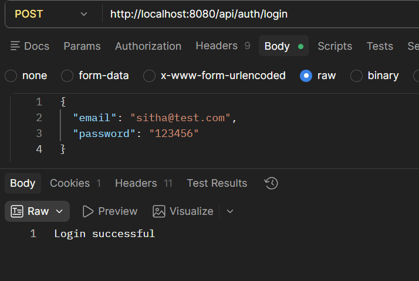
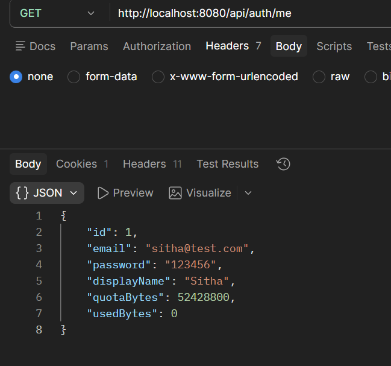
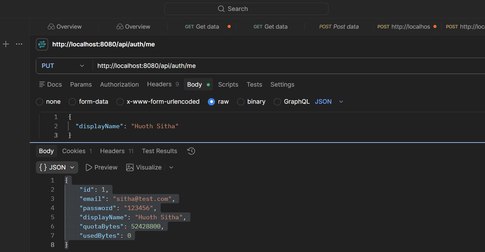
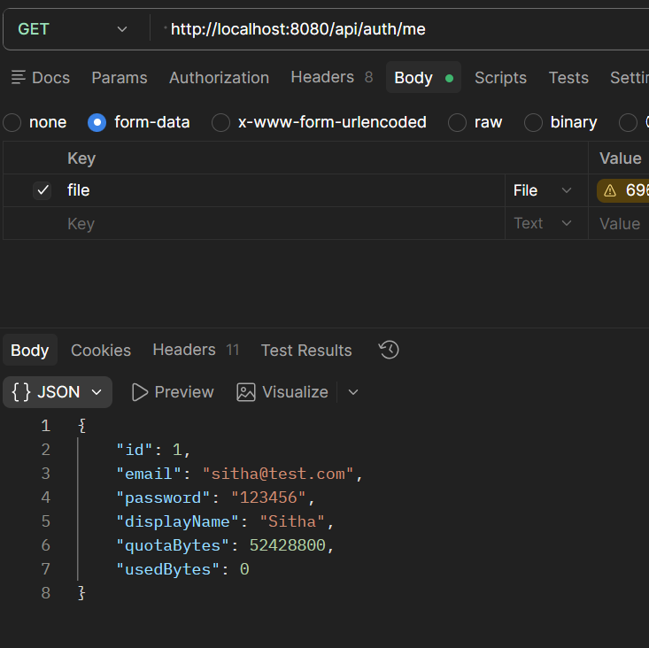
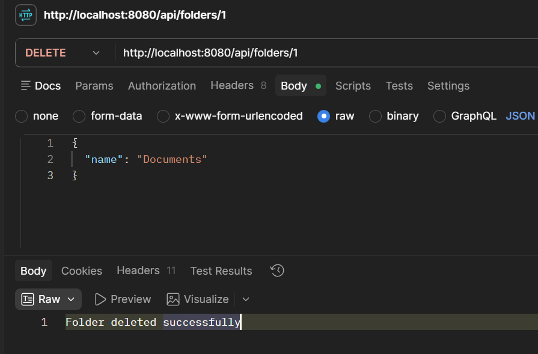
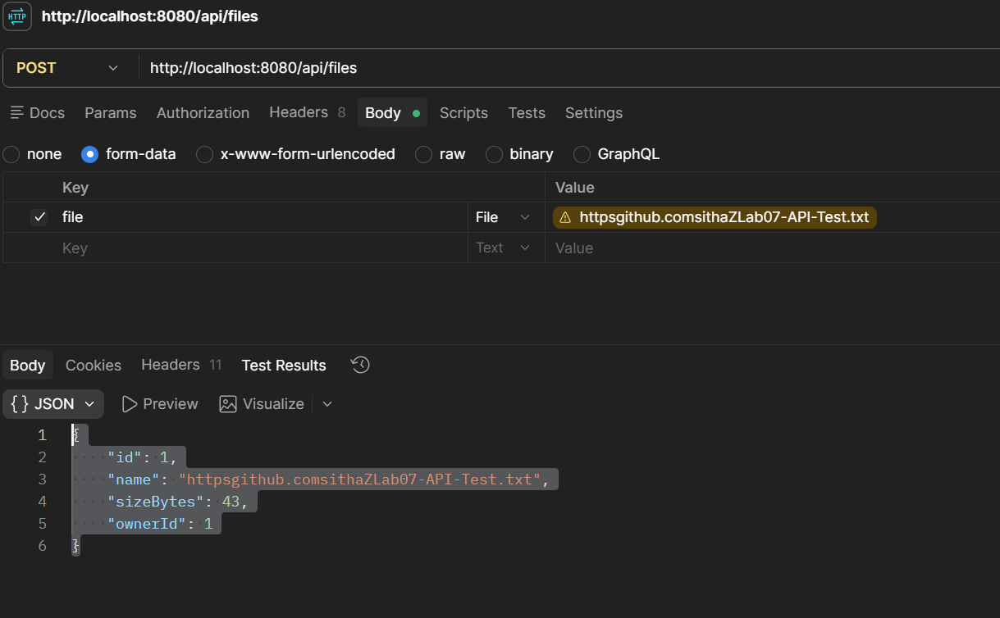
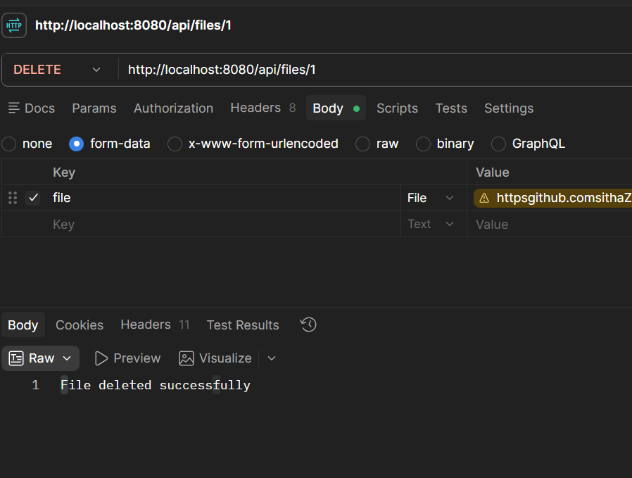
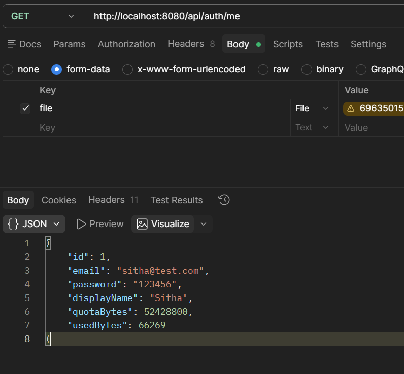
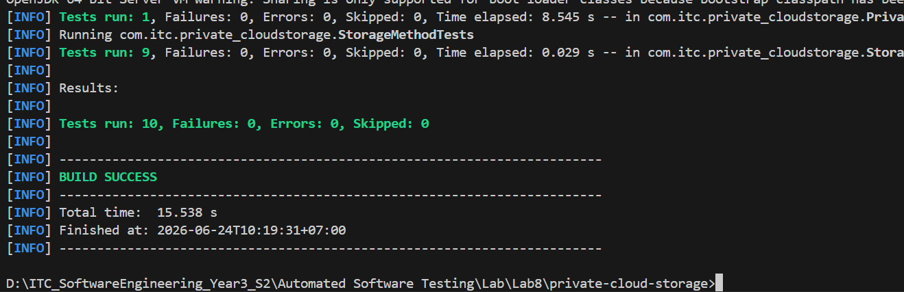
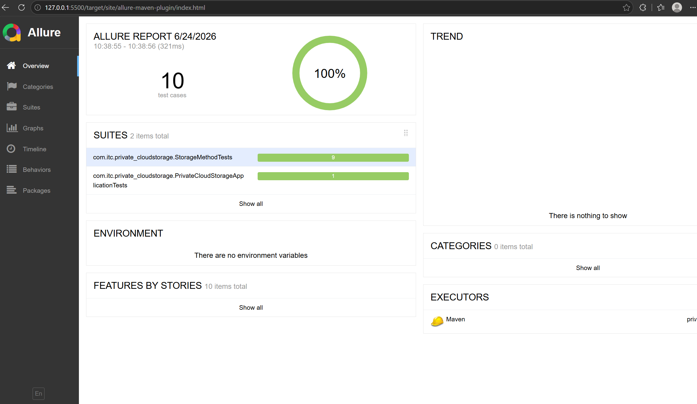

## 
Name: Huoth Sitha  
Class: Automation-Testing

# Lab 8 – Private Cloud Storage System

## Overview

This project implements a Private Cloud Storage System using Spring Boot, H2 Database, JPA, JUnit 5, and Allure Reporting.

## Features

### User Management

* Register User
* Login User
* Get Profile
* Update Profile
* Delete Profile

### Folder Management

* Create Folder
* View Folders
* Rename Folder
* Delete Folder

### File Management

* Upload File
* View Files
* Delete File

### Storage Management

* 50 MB Storage Quota
* Storage Usage Tracking
* User Data Isolation

## Technologies Used

* Java 17
* Spring Boot 3.5
* Spring Data JPA
* H2 Database
* Lombok
* JUnit 5
* Allure Report

## API Screenshots

### Authentication

### Get Profile

### Update Profile

### Delete Profile

### Folder Management

### File Management

### Delete File

### Storage Quota Tracking

## Testing

### JUnit Test Result

**Result**

* Tests Run: 10
* Failures: 0
* Errors: 0
* Status: PASSED

### Allure Report

## Conclusion

Successfully implemented:

* User Management APIs
* Folder CRUD Operations
* File Upload & Deletion
* Storage Quota Management
* User Isolation
* JUnit Automated Testing
* Allure Reporting Integration

All test cases passed successfully with generated Allure test results.
